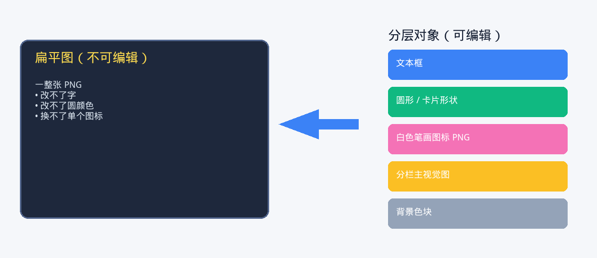
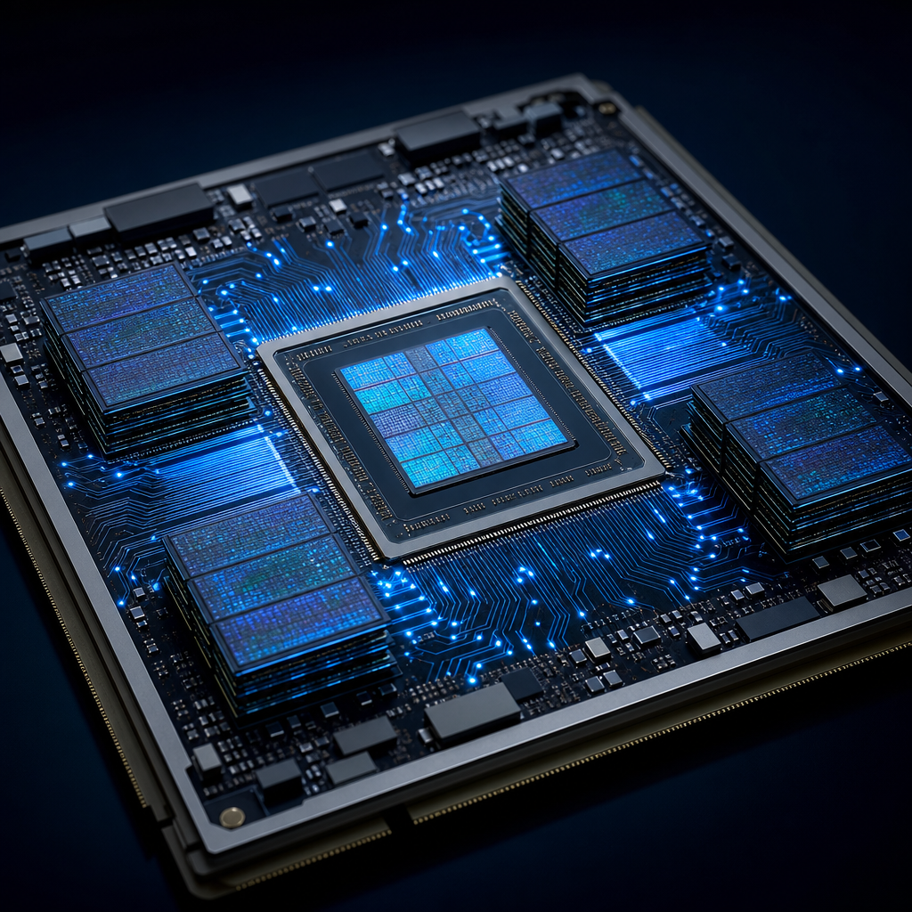
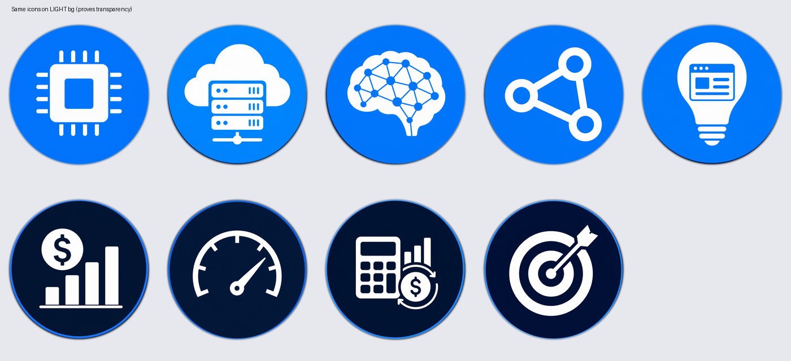
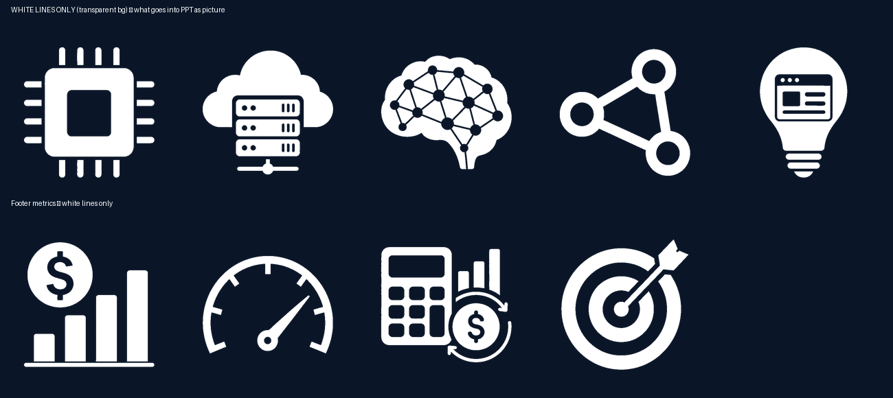
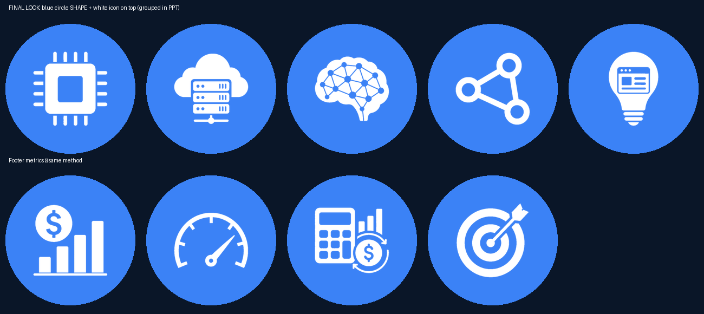

# 从「好看的图」到「可编辑 PPT」：怎样让 Agent 真正帮你把事做完

*一篇实战笔记：不是靠玄学出片，而是教会 Agent 正确的工作流——把信息图拆开，再组装成真正能改的 PowerPoint。*

---

你让 AI 做一页 slide。  
它交出来，挺好看。

然后你想改一个字……发现自己面对的是一张 **扁平大图**。

这就是分岔口。

这篇文章讲的是另一条路：用 Agent 把那张图 **重建** 成 **分层、可编辑的 `.pptx`**——字能改、圆能换色、图标能替换。重点不是「AI 会做 slide」，而是：**如果你给它对的心智模型，AI 才能帮你把事做完。**

---

## 陷阱：把整张图贴进 PPT

最快的交付，往往最没用：

> 生成一张漂亮信息图 → 整页贴进幻灯片 → 交差。

聊天里大家会夸。开会时有人说「第三列标题能改一下吗？」——你就傻了。

*看起来做完了。其实改不了。*

---

## 打通一切的心智模型

**信息图是像素；可编辑 PPT 是对象栈。**

| 你看到的 | PPT 里应该是 |
|---|---|
| 标题 / 说明 / 脚注 | 文本框 |
| 卡片、色条、色圆 | 原生形状 |
| 照片 / 插画 | 独立图片 |
| 图标笔画 | 透明底 glyph PNG |
| 图标圆形底 | 圆形 shape（实心或描边），与 glyph 组合 |

一旦你和 Agent 共享这个模型，工作就从「再美一点」变成 **「拆分 → 确认 → 组装」**。

这也是停止「为了一个烂图标，整页反复重生」的关键。

---

## 第 1 步——先锁定任务（还没开始生成之前）

先告诉 Agent「什么叫做完」：

- 比例（通常 **16:9**）
- 哪些必须可编辑（文案？颜色？图标？）
- 图标样式（实心圆 / 空心描边）
- 语言与语气

**好用的提示形状：**

> 我要的是 **可编辑** 的 16:9 PPT，不是一张扁平图。  
> 请把这张信息图拆成：文本框 + 形状 + 分栏主视觉图 + 透明图标笔画，并叠在 PPT 圆形上。  
> **先预览图标，再组装整页。**

你不是在点一张图，你是在雇一个制作搭档。

---

## 第 2 步——把视觉拆成零件

让 Agent **按栏拆素材**，而不是再生成一张超级大图。

例如各列主视觉：

*每一张之后都是可单独替换的图片对象。*

图标同理：**笔画（glyph）** 和 **圆** 是两样东西。

---

## 第 3 步——别太早相信「透明图标」

AI 出图很爱把这些烤进文件：

- 深蓝方底  
- 或「棋盘格假透明」（其实还是不透明像素）

*看起来像图标。其实是合成死图。*

哪怕清理过一轮，放到浅色底上仍可能露馅：

*看起来嵌进去，贴到 slide 上也会嵌进去。*

很多 Agent 跑飞就飞在这里：不停重生整份 PPT，却不去修 **素材本身**。

---

## 第 4 步——只留白色笔画（glyph）

干净做法：

1. 只提取 **白色笔画** → 真透明 PNG  
2. 蓝圆交给 PowerPoint，用 **形状** 做

*这才是放进 PPT 的图片。*

再用浅色底验证透明：

*没有方块。没有棋盘格。只有笔画。*

---

## 第 5 步——组装整页之前，先预览图标配方

按 PPT 最终用法做 mock：

- **列图标：** 实心蓝圆 shape + 白色笔画叠上  
- **页脚指标：** 白色笔画 + 空心描边圆  

**强制门禁：** 先给自己（或同事）看，说一句「OK」，再让 Agent 生成 `.pptx`。

这一步能省掉大量「看着不对 → 全部重来」。

---

## 第 6 步——用原生 PPT 图层组装

让 Agent 用 `python-pptx` 之类工具搭：

1. 背景 shape  
2. 顶栏 / 卡片 / 底栏（形状）  
3. 标题与正文（文本框）  
4. 图标组合 = 圆形 shape + glyph PNG  
5. 分栏主视觉图  

图标两种常见配方：

- **实心风：** 椭圆（实心填充）→ 笔画居中 → **组合**  
- **描边风：** 笔画 → 椭圆（无填充，仅描边）→ **组合**  

结果：在 PowerPoint / WPS 里，点标题就能改字；取消组合就能改圆颜色；换一张栏图不影响其他元素。

这才叫把事做完。

---

## 怎样让 Agent 帮你，而不是空转

### 要做

- 一上来就说清对象模型（「文字 / 形状 / 笔画 / 分栏图」）  
- 整页组装前，先要 **图标预览**  
- 先修素材，再重组（不要为一个图标重造宇宙）  
- 在 Cloud / 手机上要可下载链接（别给 `127.0.0.1`）  
- 把方法沉淀成可复用 skill，下次更顺  

### 别做

- 把「整图贴进 slide」当成可编辑交付  
- 让脏底图标混进终稿  
- 把可改色的圆烤进图标 PNG  
- 组装完了再改图标风格，却不回预览门禁  

### 好用提示词

**开场：**
> 把这张信息图变成可编辑的 16:9 PPT。拆成文本框、形状、分栏图、透明笔画图标。先预览图标。

**图标很脏时：**
> 只保留白色笔画为透明 PNG。圆用 PPT 形状。重组前先给我「仅笔画」和「笔画+圆」预览。

**它又交扁平图时：**
> 这不可编辑。按「拆分 → 确认 → 组装」重建成分层对象。

---

## 这和「Harness」有什么关系

碰运气成功一次，不叫系统。

一份 **skill / 作战手册**——「信息图 → 可编辑 PPT」——才是让下一次 Agent 少发疯的小 harness：

- 目标清楚  
- 验收清楚  
- 已知翻车点清楚  
- 有一道门禁（图标预览）挡住空转  

英雄不是 Agent。  
**你 + 一套好 harness** 才是。

---

## 收尾

好看图容易。  
可编辑 slide 是制作问题。

想让 Agent 帮你收尾：

1. 强制对象模型  
2. 把图拆成零件  
3. 把笔画清到「无聊的透明」  
4. 确认图标  
5. 分层组装  
6. 把方法留下来  

这样你才从「挺好看的图」走到「会上真能改的 PPT」。

---

### 本目录配图

| 文件 | 说明 |
|---|---|
| `images/00-flat-vs-layered-zh.png` | 心智模型（中文） |
| `images/01-target-infographic.png` | 起点视觉 |
| `images/02a–c-panel-*.png` | 拆开的分栏图 |
| `images/03a–b-*.png` | 脏 / 烤制图标 |
| `images/04–06-*.png` | 干净笔画与组合预览 |

### 相关 skill

流程沉淀为 **Editable PPT**（`bestpractice_editable_ppt.md`），放在 content-infra / skills。
