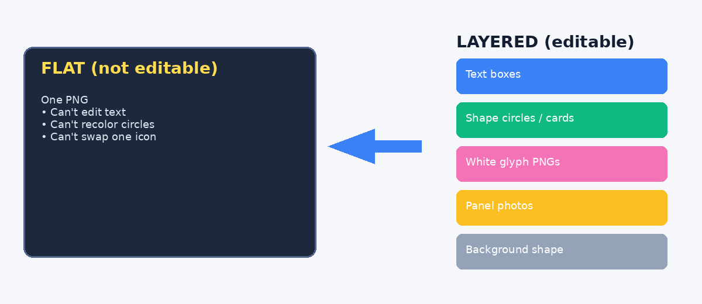

# From Pretty Picture to Editable PPT: How an Agent Actually Helps You Finish the Job

*A field note on turning an infographic into a real PowerPoint — not by magic, but by teaching the agent the right workflow.*

---

You ask an AI for a slide.  
It gives you something that looks great.

Then you try to change one word… and realize you’re staring at a **flat image**.

That’s the fork in the road.

This post is about the other path: using an agent to take that picture and rebuild it into a **layered, editable `.pptx`** — text you can type into, circles you can recolor, icons you can swap. The point isn’t “AI can make slides.” The point is **AI can help you get the job done** if you steer it with the right mental model.

---

## The trap: “just put the image into PowerPoint”

The fastest deliverable is also the least useful:

> Generate a beautiful infographic → paste it full-bleed into a slide → ship.

You get applause in the chat. You get pain in the meeting when someone says: *“Can we change the third column title?”*

*Looks done. Isn’t editable.*

---

## The mental model that unblocks everything

**An infographic is pixels. An editable PPT is an object stack.**

| What you see | What it should become in PPT |
|---|---|
| Title / labels / footnotes | Text boxes |
| Cards, bars, colored circles | Native shapes |
| Photos / illustrations | Separate pictures |
| Icon drawings | Transparent glyph PNGs |
| Icon circular backing | Shape circles (filled or outline), grouped with the glyph |

Once you and the agent share this model, the work stops being “make it prettier” and becomes “**split → approve → assemble**.”

That’s also how you stop the endless loop of regenerating the whole slide for one bad icon.

---

## Step 1 — Lock the job (before generating anything)

Tell the agent what “done” means:

- Aspect ratio (usually **16:9**)
- What must stay editable (copy? colors? icons?)
- Icon style preference (filled circle vs outline ring)
- Language / tone

**Good prompt shape:**

> I need an **editable** 16:9 PPT, not a flat image.  
> Rebuild this infographic as: text boxes + shapes + separate panel images + transparent icon glyphs on PPT circles.  
> Preview icons before assembling the full deck.

You’re not asking for a picture. You’re hiring a production partner.

---

## Step 2 — Split the visual into parts

Have the agent extract or generate **one asset per panel**, not one mega-image.

Example panels from our AI industry-chain slide:

*Each column photo is a replaceable picture object later.*

Same idea for icons: treat **glyph** and **circle** as two different things.

---

## Step 3 — Don’t trust “transparent” icons too early

AI image tools love to bake in:

- dark square backgrounds  
- or a fake “checkerboard transparency” that is still opaque pixels  

*Looks like an icon. Still a baked composite.*

Even after a first cleanup pass, light-background checks expose leftover junk:

*If it looks embedded, it will feel embedded in the slide.*

This is where many agent runs fail: they keep regenerating the whole PPT instead of fixing the **asset**.

---

## Step 4 — Keep only the white lines (the glyph)

The clean fix:

1. Extract **white strokes only** → true transparent PNG  
2. Leave the blue circle to PowerPoint as a **shape**

*This is what goes into the PPT as a picture.*

Prove transparency on a light background:

*No square. No checkerboard. Just the drawing.*

---

## Step 5 — Preview the final icon recipe *before* assembling the deck

Mock the composition the PPT will use:

- **Column icons:** filled blue circle shape + white glyph on top  
- **Footer metrics:** white glyph + hollow ring outline  

**Mandatory gate:** show this to yourself (or your stakeholder) and say “OK” before the agent builds the `.pptx`.

This single habit saves hours of “looks wrong, regenerate everything.”

---

## Step 6 — Assemble as native PPT layers

Have the agent build with something like `python-pptx`:

1. Background shape  
2. Header / cards / footer bars (shapes)  
3. Titles & body (text boxes)  
4. Icon groups = circle shape + glyph PNG  
5. Panel photos  

For icons:

- **Filled style:** oval (solid fill) → glyph centered → **group**  
- **Outline style:** glyph → oval (no fill, stroke) → **group**  

Result: in PowerPoint / WPS you can click a title and edit it; ungroup an icon and recolor the circle; replace one panel image without touching the rest.

That’s the job getting done.

---

## How to work with the agent so it helps (not loops)

### Do

- State the object model up front (“text / shapes / glyphs / panels”)  
- Demand **icon previews** before full assembly  
- Fix assets, then reassemble (don’t rebuild the universe for one icon)  
- Ask for a real download link if you’re on Cloud/mobile (not `127.0.0.1`)  
- Save the method as a reusable skill so next time starts smarter  

### Don’t

- Accept “I pasted the infographic into the slide” as editable  
- Let baked backgrounds ride into the final deck  
- Bake editable chrome (colored circles) into icon PNGs  
- Change icon style *after* assembling without going back to the preview gate  

### Prompt snippets that work

**Start:**
> Convert this infographic into an editable 16:9 PPT. Split into text boxes, shapes, panel images, and transparent glyph icons. Preview icons first.

**When icons look dirty:**
> Keep only the white lines as transparent PNGs. Put circles back as PPT shapes. Show me glyph-only and glyph-on-circle previews before rebuilding.

**When it ships a flat image again:**
> That’s not editable. Rebuild as layered objects per the split→approve→assemble workflow.

---

## What this has to do with “harness”

A one-off lucky run is not a system.

A **skill / playbook** — “infographic → editable PPT” — is the small harness that makes the next agent run less chaotic:

- clear goal  
- clear acceptance checks  
- known failure modes  
- a gate (icon preview) that prevents thrash  

The agent isn’t the hero. **You + a good harness** are.

---

## Closing

Pretty pictures are easy.  
Editable slides are a production problem.

If you want an agent to help you finish:

1. Force the object model  
2. Split the picture into parts  
3. Clean glyphs until they’re boringly transparent  
4. Approve icons  
5. Assemble layers  
6. Keep the method for next time  

That’s how you go from “nice image” to “I can actually use this in the meeting.”

---

### Assets in this draft folder

| File | What it shows |
|---|---|
| `images/00-flat-vs-layered.png` | Mental model |
| `images/01-target-infographic.png` | Starting visual |
| `images/02a–c-panel-*.png` | Split panel photos |
| `images/03a–b-*.png` | Dirty / baked icons |
| `images/04–06-*.png` | Clean glyphs + composition previews |

### Related skill

Principles distilled from this workflow live as **Editable PPT** (`bestpractice_editable_ppt.md`) in content-infra / skills.
